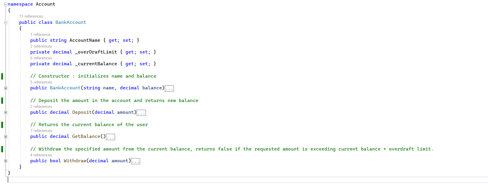
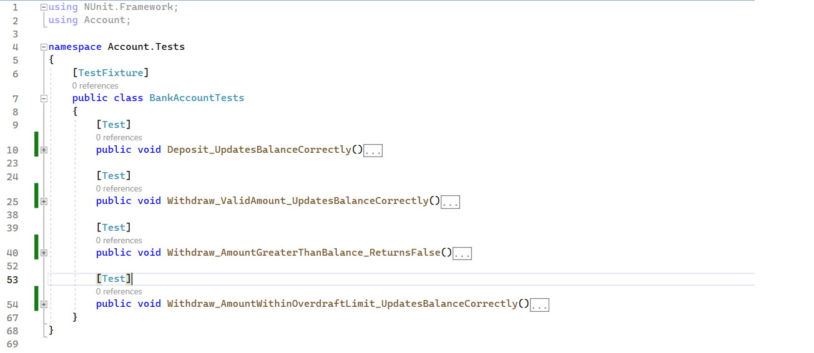
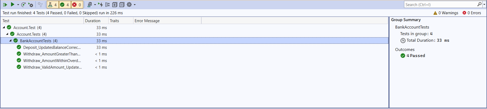

# NUnit Testing with C#

### Description
Engaging with unit tests within an actual C# project proves to be highly captivating. The process involves establishing a new project dedicated to testing your primary project. However, exercise caution when selecting actions to test; they need to be independent and capable of execution beyond their originating class.

This solution has two projects:

1. **Account** which has the file BankAccount.cs and Program.cs 

*BankAccount.cs* has a class (Bank Account) which controls the accounting operation such as deposit, withdraw and retreiving balance

*Program.cs* is an entry point for the application to perform bank transactions

2. **Account.Test** which contains the unit test case for our application, inside BankAccount.Tests.cs

### Installing
Open this project in your Visual Studio 2022 and make sure to open the "Test Explorer Window" to run the unit tests(Test > Windows > TestExplore).

### Runnning Test
The test project has an archive called "BankAccountTest.cs" there you can see all the function which the unit test will execute automated. check them and feel free to add, modify and play with it.

